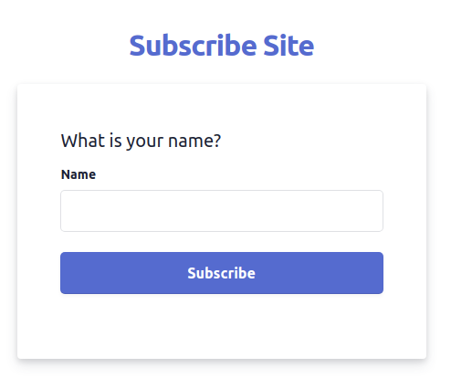
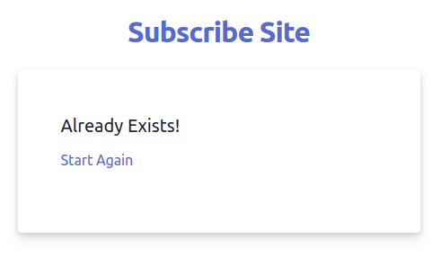

# 2. Data Management
data 관리 및 volume에 대해 알아봅니다.

## Data
data는 크게 3가지 종류로 나눌 수 있습니다.
- Application (Code + Environment): 개발자가 작성한 코드로 build시 image에 추가됩니다. image가 한번 빌드되면 변경되지 않습니다, 즉 read-only입니다.
- Temporary App Data: container 실행중에 user input등을 통해 생성되는 데이터로, 메모리나 임시파일에 저장됩니다. read-write가능하고, container내에 저장되는 일시적인 데이터입니다.
- Permanent App Data: container 실행중에 파일이나 DB에 저장되는 데이터로 container가 stop되더라도 잃어버려서는 안되는 데이터입니다. volume으로 저장하는 영구적인 데이터입니다.

## About Example
이름을 입력해서 subscribe하는 간단한 nodeJS application 예제입니다.  
  
이전에 구독한 적이 있다면 ```pages/check.html```로 이동하게 됩니다.  
  

구독여부를 체크하는 방식은 다음과 같습니다.
```js
// server.js
app.post('/subscribe', async(req, res) => {
  const name = req.body.name;

  const tempFilePath = path.join(__dirname, 'temp', name);
  const finalFilePath = path.join(__dirname, 'subscription', name);

  // input으로 입력한 값에 대해 temp 디렉토리에 파일을 생성합니다
  await fs.writeFile(tempFilePath, "");

  // subscription 디렉토리에 동일한 파일이 있는지 확인합니다
  fs.access(finalFilePath, contstants.F_OK)
    .then(async() => {
      // 이미 구독을 했다면 check.html로 이동합니다
      res.redirect('/check')
    }).catch(async() => {
      // input으로 입력한 값에 대해 subscription 디렉토리에 파일을 생성합니다
      await fs.rename(tempFilePath, finalFilePath);
      res.redirect('/');
    })
});
```