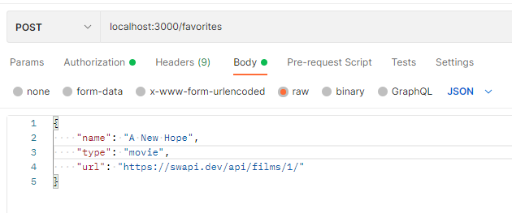

# 3. Container Communication
container가 host machine, host machine내의 다른 container 또는 외부(HTTP)와 어떻게 communication을 할 수 있는지 알아봅니다.

## About Example
movie와 people을 조회할 수 있고, local의 mongodb에 favorite movie 및 character를 저장할 수 있는 NodeJS application 예제입니다.  
POST /favorites를 전송하면, GET /favorites로 결과를 확인할 수 있습니다.  
